# Orinoco
### A simple Amazon.com-like store using Node.js and MySQL.

### **How it works**

Enter `node orinoco` from the command line.

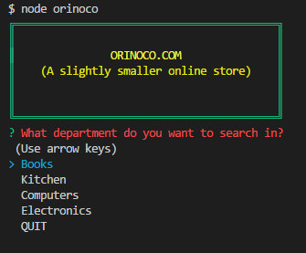

The store's welcome screen presents the user with a banner and the a list of departments to shop in.  The main menu also offers QUIT as an option.  QUIT will return the user gracefully to the command line without needing to use CTRL-C to exit the application.  Choosing a department will return a list of items and their price.

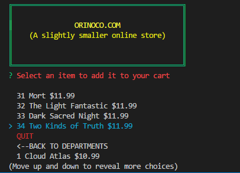 

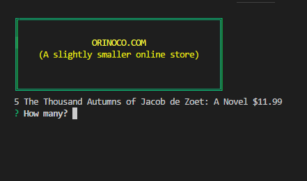

The listed items are selectable.  After selecting an item, the app will ask the user to input a quantity.  Validation in the prompt will enforce that only an integer is give. Hitting ENTER will then add that item to the user's shopping cart.  The banner will update with the number of items in the cart and then offer the user the opportunity to continue shopping, checkout or QUIT.  Choosing to continue will return the user to the welcome screen where they can choose another department to shop in.

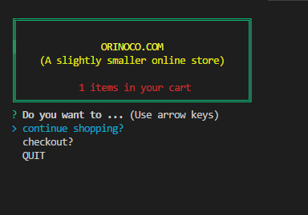

When the user has finished shopping, choosing checkout will take them to their shopping cart where they can review their items and see the total order amount.  They can then choose to place the order or cancel.

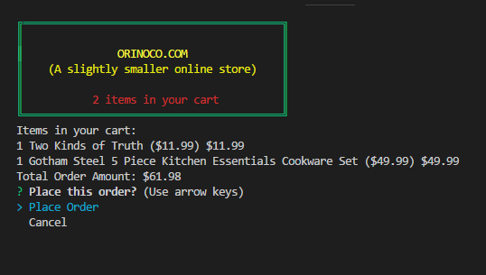

Choosing to place the order will update those rows in the products database table with a reduced quantity and an increased product sales amount.  

Before update:

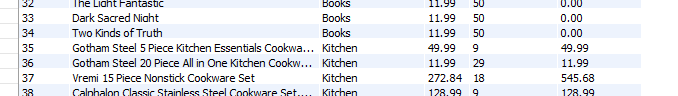

After update

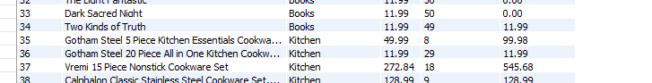

The user also gets a nice thank you and an opportunity to shop again or QUIT.

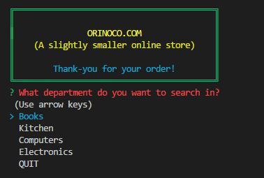

## Manager app

Entering `node manager` from the command line will launch the manager app.  

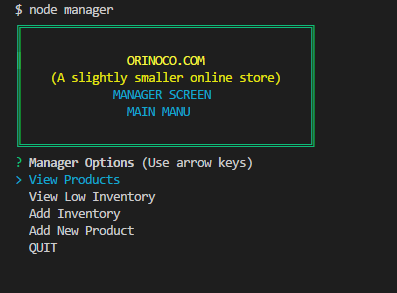

The options are View Products, View Low Inventory, Add Inventory and Add New Product.

View Products and View Low Inventory will result in a listing of products.  These function the same with the difference being that View Low Inventory will only list items with a quantity less than 5.

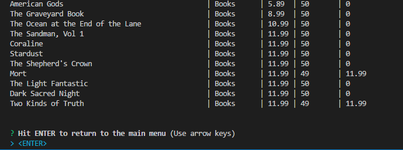

Add Inventory allows the manager to resupply selected items.  

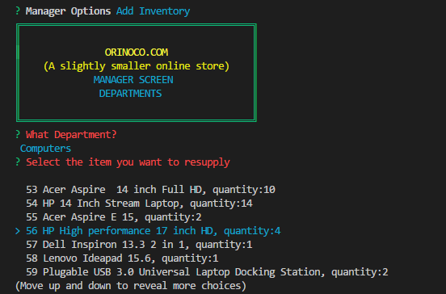

After choosing an item to resupply, the app will ask for a quantity.  

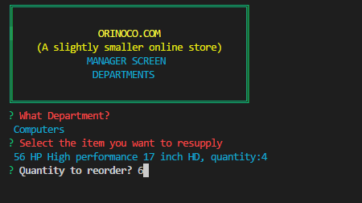

Upon entering an integer quantity, the app will update the quantity in the appropriate row in the products database table.

Before

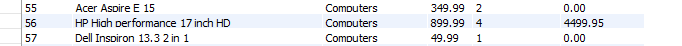

After

 

## Behind the Scenes

This app interacts with a MySQL database called orinoco_DB.  A schema file is included for creating the database and two tables: products and departments.  

